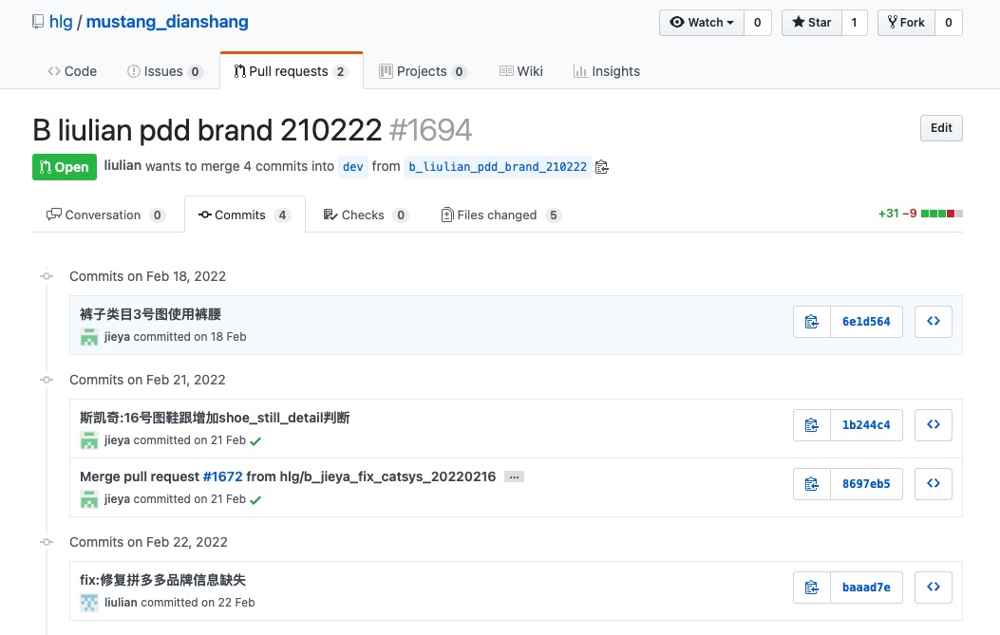

# Code Review

review的时候要参照规范进行

- code review 和git的提交习惯息息相关, git提交的粒度细, 根据业务或功能提交git, 这样的代码review起来就比较容易, 相反, 对于git提交习惯 攒够了一天或好几天的作为一次提交, 中间夹杂了多次需求、debug、等代码, 这样代码review起来就很吃力
- 复杂业务场景 不写注释的代码, review起来也很吃力, 对于复杂逻辑的代码, 应该稍加注释, 不是怕别人看不懂, **是怕自己回头看的时候, 想砂仁**

- 适当的review可以增进伙伴间的感情, 使得伙伴间感情牢不可破, 这对脱离单身有很好的助益
- review的时候看破不说破, 好好说话也是感情升温的关键
- review也是增强团队协作的一个绝妙的方式

## 最佳实践
当一个pr发起的时候， 将相关的pr链接发给或者告知相关的同时同时

如图示：

发起者需要注意：
- 每次commit的代码量少而且清晰，**必须** 按照git提交规范填写相关信息
- 一次大的pr要详尽描述改动点、差异点、新技术栈、潜在的风险、或不可控的其他因素说明
- 单次pr不宜过大

审核者需要注意：
- 根据改动点和差异点，新技术栈变动，着重关注这些内容
- 改动文件过多的情况下， 按照每个commit去review变动
- 不管review结果如何， 都有评论点什么， 哪怕时捧臭脚都行
- 如果有更好的idea， 一定要大声说出来， 积极性的建议什么时候都是受欢迎的，如果觉得小伙伴写的不好，那么

