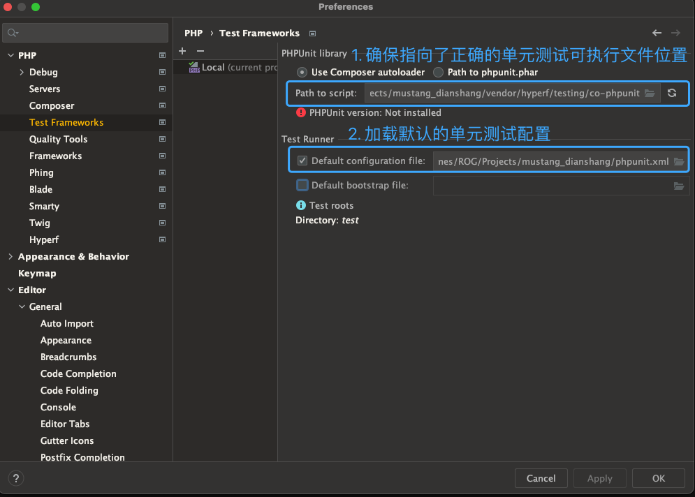
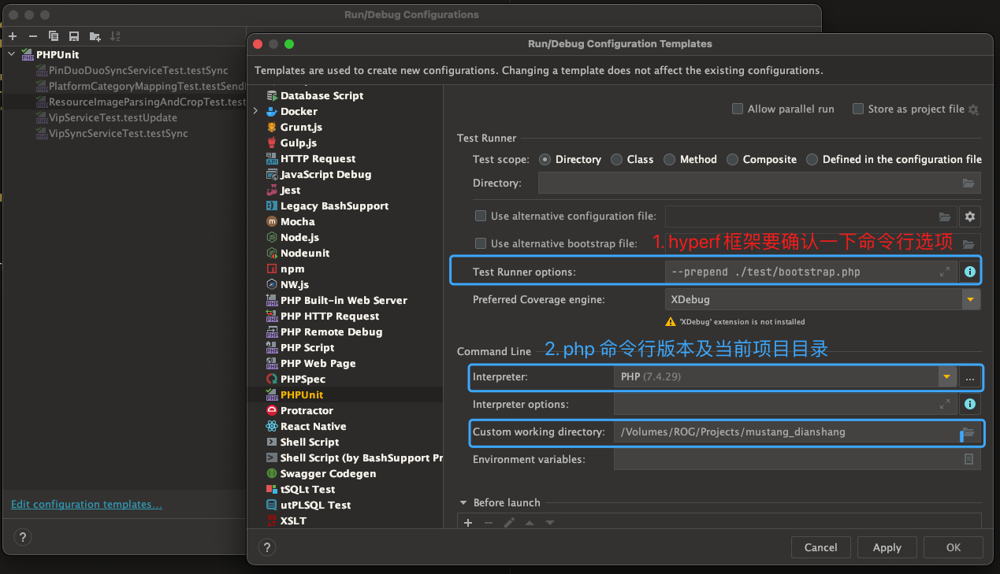
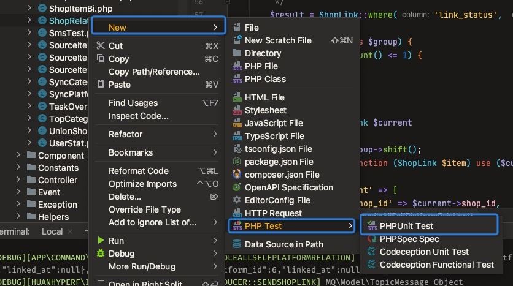

# 单元测试-最佳实践指南
> 最佳实践指南基于 hyperf框架 及 PHPStorm IDE的基础上


## IDE中的配置

### PHPStorm

> 正确配置单元测试框架



> 测试模版配置



### Bootstrap File

> 正确配置初始化脚本
```php
declare(strict_types=1);
/**
 * This file is part of Hyperf.
 *
 * @link     https://www.hyperf.io
 * @document https://doc.hyperf.io
 * @contact  group@hyperf.io
 * @license  https://github.com/hyperf/hyperf/blob/master/LICENSE
 */
ini_set('display_errors', 'on');
ini_set('display_startup_errors', 'on');

error_reporting(E_ALL);
date_default_timezone_set('Asia/Shanghai');

! defined('BASE_PATH') && define('BASE_PATH', dirname(__DIR__, 1));
$hook = version_compare(swoole_version(), '4.6.0') >= 0 ? SWOOLE_HOOK_ALL ^ SWOOLE_HOOK_SOCKETS : SWOOLE_HOOK_ALL;
!defined('SWOOLE_HOOK_FLAGS') && define('SWOOLE_HOOK_FLAGS', $hook);

require BASE_PATH . '/vendor/autoload.php';

Hyperf\Di\ClassLoader::init();

$container = require BASE_PATH . '/config/container.php';

$container->get(Hyperf\Contract\ApplicationInterface::class);
```
为了保持目录的一致，生成单元测试文件都 **应该** 通用IDE默认来生成
> `option` + `1` 快速定位文件位置， 右键 `New` 来生成测试文件，保持目录规则一致



## 单元测试场景
根据目前框架中单元测试划分几个典型的使用场景
### 接口测试
> 这里特指控制器中的单元测试

一般的接口开发中，一般的测试方法通过Postman类似的工具、或者curl命令行进行测试，这种场景下必须启动框架，并且后来的小伙伴无法对既往测试
的数据有所感知，所以建议在单元测试中，通过继承 `HttpTestCase` 基类来实现接口测试，接口测试中，常见的场景及注意点如下：
- 对数据校验规则的校验
- 对期望的判断
- 有先后顺序、先后依赖的参数构建

> 批量生成数据可以通过数据供给器 `dataProvider` 来实现 有先后顺序依赖的 可以通过 `depends` 来实现
 
在对数据规则做校验测试的时候 数据供给器 就能起到快速、便捷的作用
例如可以定义如下数据供给器：
```php
public function formDataProvider()
{
    return [
        'case1' => ['param1' => 1],
        'case2' => ['param1' => 2],
    ];
}
```
并在后续的测试方法中， 将数据来源传入需要的方法中, 在该方法中，将会根据数据供给器的参数数量， 多次调用该测试方法
```php
/**
 * @dataProvider formDataProvider
 */
public testMethod1()
{
}
```
### 方法测试
> 此处特指非控制器类中的单元测试

在一些特定的方法测试中， 可能会涉及到数据库连接、文件IO、 队列、消息分发、第三方请求等操作，很多场景下，我们要测试的方法并不希望有实际的
影响，如：队列生产、消费，发起请求、文件IO、数据库读写，这些场景下需要对单元测试做一些特殊的处理：

#### 数据库测试
> 单元测试应该是 无状态、 幂等、 无需人工介入校验的， 现行的很多单元测试是需要一些特定的数据上下文的， 这种测试方法现阶段作为排查入口，建议继续维持

数据库测试的难点及重点就是基境的搭建，主流的几个基境搭建方法：
- 通过引入 `phpunit/dbunit` 组件进行基境搭建， 主要通过xml配置table的dataSet
- 通过 `doctrine/data-fixtures` 进行基境搭建， 主要通过类方法定义搭建指定表及其数据

#### 文件IO测试
文件IO的主要方法主要通过一下两种：
- 利用操作系统的文件系统进行目录操作，`setUp`中初始化， `tearDown`中销毁, 可能会遗留脏目录，所以这个方法不是特别优雅
- 利用一些模拟文件操作系统的组件进行模拟， 诸如：`mikey179/vfsstream` [示例](https://github.com/bovigo/vfs-stream-examples)

示例按照`vfsStream` 进行文件系统模拟：

```php
    public function setUp(): void
    {
        parent::setUp();
        // 初始化一个虚拟文件系统
        $this->root = vfsStream::setup();
    }

    public function testExists()
    {
        // 文件系统检查测试
        $this->assertFalse($this->root->hasChild('aaa'));
        file_put_contents($this->root->url() . '/aaa', '  ');
        $this->assertTrue($this->root->hasChild('aaa'));
    }

    public function testWithComplicatedDir()
    {
        $structure = [
            'examples' => [
                'test.php'    => 'examples/test.php',
                'other.php'   => 'Some more text content',
                'Invalid.csv' => 'Something else',
            ],
            'an_empty_folder' => [],
            'badlocation.php' => 'some bad content',
            '[Foo]'           => 'a block device'
        ];
        // 根据数组生成复杂的目录结构
        $root = vfsStream::setup('root', null, $structure);
        $this->assertTrue($root->hasChild('examples/test.php'));
        $this->assertEquals(file_get_contents($root->url() . '/examples/test.php'), 'examples/test.php');
    }
```
#### 其他
在涉及队列生产， 消费、 及其他特定方法需要模拟通过`Mockery` 对容器 `Container`进行部分模拟，再对实际方法进行具体模拟，就可以实现具体的要求
> 因为hyperf框架中，类的实例化都是通过容器注入， 在对框架自带的类进行mock的时候， 不能简单的根据mockery提供的方法进行mock
示例如下：
```php
// 在基础类中Mock容器 及 tearDown中关闭Mock
    /**
     * @var Container
     */
    protected $container;

    protected function setUp():void
    {
        !defined('BASE_PATH') && define('BASE_PATH', dirname(__DIR__));
        // makePartial标识只mock部分 并非全部都mock实际根据场景选择是否mock部分
        $container = \Mockery::mock(Container::class, [(new DefinitionSourceFactory(true))()])->makePartial();
        // mock框架的Config类的时候 使用以下方法
        $container->define(ConfigInterface::class, function () {
            $config = \Mockery::mock(Config::class);
            $config->shouldReceive('get')->andReturnNull();
            return $config;
        });
        ApplicationContext::setContainer($container);
    }

    public function tearDown():void
    {
        \Mockery::close();
    }
```
以下示例是对队列触发的一个单元测试例子：
```php
    public function testShopEventTrigger()
    {
        // 先mock了一个队列处理类
        $queueHelper = \Mockery::mock(QueueHelper::class);
        // 定义该方法在接手参数4的时候应该触发一次 sendShopUpdateMsg 并 返回 true
        $queueHelper->shouldReceive('sendShopUpdateMsg')
            ->with(4)
            ->andReturnTrue()
            ->once();

        $this->mockQueueHelper($queueHelper);
        // 触发变更 检查时候正确触发队列入队
        $resp = $this->changeShopName();
        $this->assertTrue($resp);
    }
    // 在容器里面定义了get 和 make方法应该返回的队列处理类对象
    private function mockQueueHelper(MockInterface $queueHelper)
    {
        $this->container
            ->shouldReceive('get')
            ->with(QueueHelper::class)
            ->andReturn($queueHelper);
        $this->container
            ->shouldReceive('make')
            ->with(QueueHelper::class, [])
            ->andReturn($queueHelper);
    }
```
##Tips##
> Trait 和 抽象类 可以独立Mock以后进行测试 通过 `getMockForTrait`, `getMockForAbstractClass` 对目标进行Mock处理
> 第三方请求、 Web服务可以通过 `getMockFromWsdl` 进行Mock处理， 这将不会发生实际的Web请求 但是它需要基于WSDL进行的， 需要预先完善相关的网络服务


### 断言及注解
单元测试中， 如果一个方法中没有断言，那方法会被标记为风险测试， 常用的断言如下：

#### 断言
断言的完整参考文档见 [断言介绍](https://phpunit.readthedocs.io/zh_CN/latest/assertions.html)
> 断言是可以静态调用的 也可以通过非静态的方法调用


| 分类     | 说明                                                                                                                                                                  | 备注  |
|--------|---------------------------------------------------------------------------------------------------------------------------------------------------------------------|-----|
| 类型断言   | assertFalse、assertInstanceOf、assertInternalType、 assertNan、 assertNull 、assertTrue、 assertIsString、assertIsNumeric、                                                 |     |
| 类断言    | assertClassHasAttribute、assertClassHasStaticAttribute、 assertObjectHasAttribute、                                                                                    |     |
| 文件断言   | assertDirectoryExists、 assertDirectoryIsReadable、assertDirectoryIsWritable、assertFileEquals、assertFileExists、assertIsReadable、                                      |     |
| 数组断言   | assertArrayHasKey、  assertArraySubset、  assertContains、 assertContainsOnly、                                                                                         |     |
| Json断言 | assertJsonFileEqualsJsonFile、assertJsonStringEqualsJsonFile、 assertJsonStringEqualsJsonString、                                                                      |     |
| 其他     | assertSame、assertCount、 assertEmpty、assertEquals、assertGreaterThan、assertInfinite、 assertLessThan 、 assertLessThanOrEqual、  assertRegExp、assertStringMatchesFormat、 |     |

#### 注解
单元测试中注解的功能可以简化代码， 并且可以提供强大的功能
完整的注解描述文档请参照[注解介绍](https://phpunit.readthedocs.io/zh_CN/latest/annotations.html#)

| 注解            | 说明                     | 备注  |
|---------------|------------------------|-----|
| @before       | 标注执行的优先顺序              |     |
| @after        | 标注执行的兜底顺序              |     |
| @depends      | 依赖说明                   |     |
| @covers       | 标识单元测试覆盖               |     |
| @dataProvider | 数据供给器                  |     |
| @requires     | 标记执行所需要的前提条件           |     |
| @test         | 标记方法为测试方法，与test开头的效果一致 |     |
