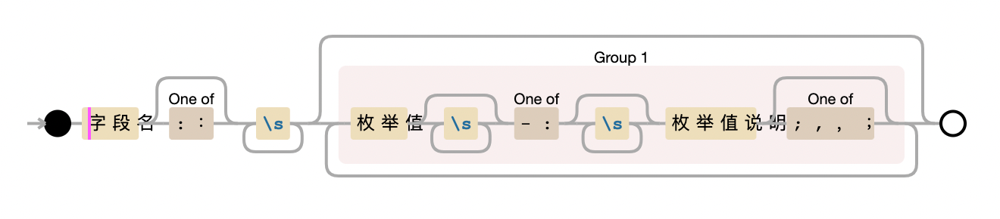

# 数据库使用规范

## 数据表

创建数据表的时候，**必须** 遵守以下约定：

1. 表名 **应该** 简明扼要，**应该** 加以注释说明表的用途，涉及单词均用单数形式
2. 同一业务的数据表 **应该** 使用统一的前缀
3. 数据表的表名、字段名 **必须** 严格按照 *小写下划线* 的格式进行命名
4. 数据表 **必须** 要有主键， 单表时自增， 分表时使用 `TinyID` 进行自增, 主键 **应该** 是无意义的， 与业务无关的
5. 数据表中标识布尔值 是、否时， **应该** 使用 `tinyint` 1，0来标识
6. **绝不** 在数据库中使用外键、函数、触发器、存储过程等
7. 时间应该使用 `Timestamp` 类型，在`sql_mode` 为严格模式下，时间时段可以为 `null`, 否则 **应该** 使用 `0000-00-00 00:00:00` 作为默认值
8. 除了*严格模式下*的时间字段 和 json类型字段， 数据表的字段都不允许为 `null`，都 **应该** 有默认值
9. 数据字段的注释说明 **必须** 要清晰，含枚举值的字段 **必须** 要对枚举值做详细说明，注释的规范 **应该** 参照 [注释规范](#注释规范)
10. **应该** 避免使用 `text`、 `blob`等类型的字段
11. 字符编码 **应该** 统一使用 `utf8mb4`

## 索引

对数据列进行索引的时候，充分考虑 `最左原则`，**应该** 参照以下规范进行：
1. 索引 **应该** 建立在离散度高（区分度高）的字段， 如果一个字段最多不过三四个值，那么在这个字段上建立索引的效果并不会好
2. 复合索引的建立要考虑查询的习惯， 索引的命中要满足最左原则才会生效
3. 在join on、order by常用的字段上加索引，效果最佳
4. 避免因为sql写法导致索引失效，列函数处理，隐式转换，左模糊都会导致索引失效

## 注释规范

表名没有枚举值，故注释规范仅适用字段注释
```text
# 伪正则实现
字段名([:：]?\s+(枚举值\s*[-:]\s*枚举值对应说明[;,，；]?)*)?
```


1. 无枚举值的字段规则同表名，应该以字符开头且以字符结尾，不包含任何空格
2. 字段和枚举值间可以用中英文模式下的 `分号` 且包含一个到多个空格
3. 枚举值在前，说明在后，每组说明都应该用英文模式下 `中划线` 或 `冒号` 分割， 分割符前后可以带有空格， 结尾可以适用中英文模式下的 `逗号` 或 `分号` 分隔


## 其他
